# 🕵️ LA Noire - Police Department Management System

> A comprehensive web-based police department management system inspired by the classic detective game "LA Noire"


## 🎯 Overview

LA Noire Police Management System is a sophisticated web application designed to digitalize and streamline police department operations. It handles everything from case management and evidence tracking to suspect interrogation and trial proceedings.

### Key Objectives

- **Digitalize** traditional paper-based police operations
- **Centralize** case, evidence, and suspect management
- **Automate** workflows and reduce administrative burden
- **Provide** role-based access control for different law enforcement levels
- **Enable** collaboration between detectives, officers, and judges

### Project Inspiration

The system mirrors the case investigation mechanics of the video game "LA Noire", adapted for a real-world police department setting in 1940s Los Angeles.

---

## 🏗️ Architecture

### System Architecture

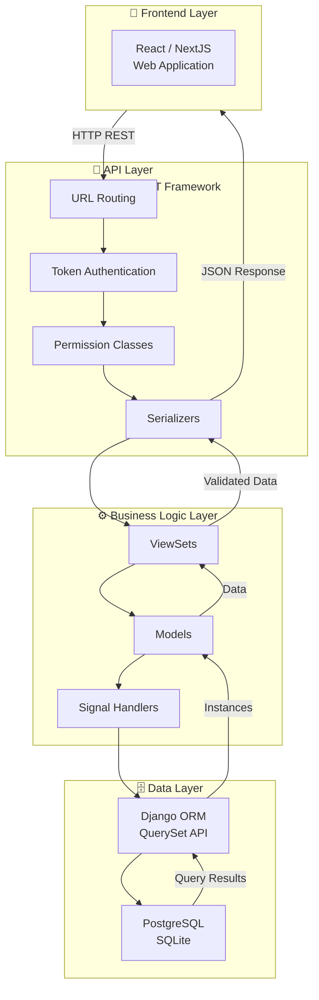

### Django Apps Architecture

```mermaid
graph TB
    Base["base<br/>Project Config"]
    
    User["👤 User App<br/>Authentication & RBAC"]
    User1["Models: User, Role"]
    User2["Views: Login, Register"]
    User3["Permissions: IsAdmin, IsDetective"]
    
    Crime["🚨 Crime App<br/>Cases & Evidence"]
    Crime1["Models: Crime, Case, Complaint"]
    Crime2["Views: CaseViewSet, ComplaintViewSet"]
    Crime3["Signals: Auto-assign Detective"]
    
    Suspect["🔍 Suspect App<br/>Suspect Management"]
    Suspect1["Models: Suspect, SuspectCrime"]
    Suspect2["Views: SuspectViewSet, InterrogationViewSet"]
    Suspect3["Signals: Update Priority Scores"]
    
    Witness["📸 Witness App<br/>Evidence Management"]
    Witness1["Models: Evidence, Testimony, Biological..."]
    Witness2["Views: EvidenceViewSet"]
    Witness3["Validators: VehicleEvidence Constraints"]
    
    Reward["🏆 Reward App<br/>Reward System"]
    Reward1["Models: Reward, Report"]
    Reward2["Views: RewardViewSet"]
    
    Payment["💳 Payment App<br/>Transactions"]
    Payment1["Models: Transaction"]
    Payment2["Views: TransactionViewSet"]
    
    Base --> User
    Base --> Crime
    Base --> Suspect
    Base --> Witness
    Base --> Reward
    Base --> Payment
    
    User --> User1
    User --> User2
    User --> User3
    
    Crime --> Crime1
    Crime --> Crime2
    Crime --> Crime3
    
    Suspect --> Suspect1
    Suspect --> Suspect2
    Suspect --> Suspect3
    
    Witness --> Witness1
    Witness --> Witness2
    Witness --> Witness3
    
    Reward --> Reward1
    Reward --> Reward2
    
    Payment --> Payment1
    Payment --> Payment2
```

### Request-Response Flow

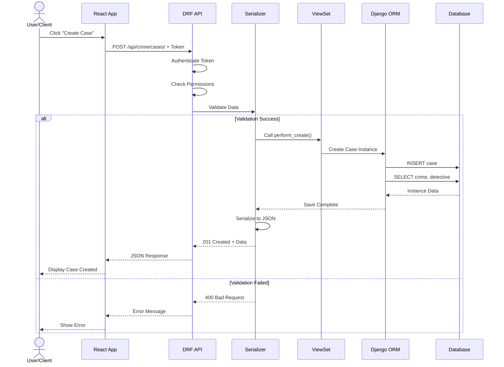

### Data Flow

1. **User Request** → Frontend application (React/NextJS)
2. **API Call** → Django DRF endpoint with authentication token
3. **Validation** → Serializer validates input data
4. **Permissions** → Permission classes check user access
5. **Business Logic** → ViewSets process request
6. **Database** → ORM queries PostgreSQL/SQLite
7. **Response** → Serialized JSON back to frontend

---

## 🎯 Design Patterns & Key Workflows

### Case Investigation Lifecycle

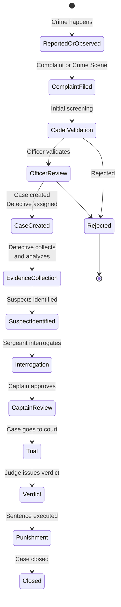

### Suspect Status Progression

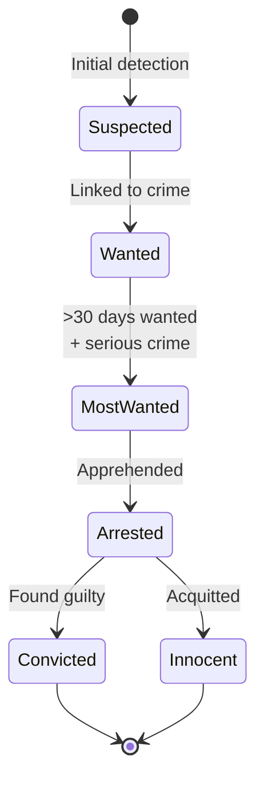

### Evidence Types & Relationships

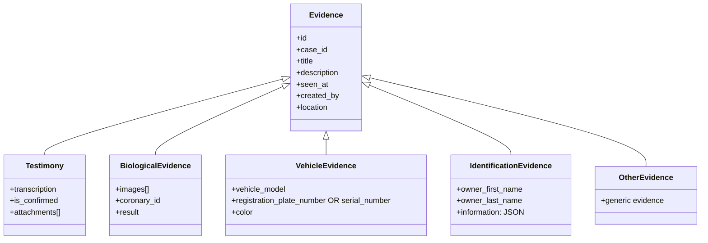

---

## 🛠️ Tech Stack

### Backend

| Component | Technology | Purpose |
|-----------|-----------|---------|
| **Framework** | Django 4.2+ | Web framework & ORM |
| **API** | Django REST Framework | RESTful API development |
| **Database** | PostgreSQL/SQLite | Data persistence |
| **Authentication** | Django Token Auth | API token-based auth |
| **Documentation** | drf-spectacular (Swagger) | API documentation |
| **Image Processing** | Pillow | Image handling |
| **Fake Data** | Faker | Test data generation |


### Development & DevOps

| Tool | Purpose |
|------|---------|
| **Docker** | Containerization |
| **Docker Compose** | Multi-container orchestration |
| **Git** | Version control |
| **Python 3.12+** | Runtime |
| **pip** | Package management |

---

## ✨ Features

### 👮 Core Crime Management

- ✅ **Case Creation** - From complaints or crime scenes
- ✅ **Multi-level Crime Classification** - 4 severity levels
- ✅ **Evidence Management** - 5 types of evidence with metadata
- ✅ **Suspect Tracking** - Status progression (suspected → wanted → most wanted)
- ✅ **Interrogation Flow** - Multi-person interrogations with scoring
- ✅ **Trial Processing** - Judge-based verdict and sentencing

### 📊 Investigation Tools

- ✅ **Detective Board** - Visual case analysis (cork board style)
- ✅ **Evidence Linking** - Connect physical evidence to crimes
- ✅ **Suspect Profiling** - Detailed suspect information & history
- ✅ **Timeline Management** - Crime scene documentation
- ✅ **Witness Management** - Testimony and statement recording

### 💰 Advanced Features

- ✅ **Reward System** - Generate bounties for tips
- ✅ **Payment Integration** - Process bail & fine payments
- ✅ **Report Generation** - Create detailed case reports
- ✅ **Complaint Management** - Handle public complaints
- ✅ **Priority Scoring** - Automatic wanted list ranking

### 🔐 Access Control

- ✅ **Role-Based Access Control** - 10+ specialized roles
- ✅ **Dynamic Role Management** - Create/modify roles without code changes
- ✅ **Permission Granularity** - Endpoint-level access control
- ✅ **Data Isolation** - Users see only relevant data
- ✅ **Audit Trail** - Track who did what

### 📱 User Interface Features

- ✅ **Responsive Dashboard** - Role-specific widgets
- ✅ **Real-time Updates** - WebSocket-ready architecture
- ✅ **Advanced Filtering** - Search & filter cases, suspects, evidence
- ✅ **Bulk Operations** - Handle multiple items efficiently
- ✅ **Export Capabilities** - Generate reports in multiple formats

---

## 👥 User Roles

The system supports **13 distinct user roles** with specific permissions:

| Role | Level | Key Responsibilities |
|------|-------|----------------------|
| **Administrator** | 0 | System management, user management, role configuration |
| **Chief** | 1 | Department oversight, critical case approval |
| **Captain** | 2 | Case approval, officer supervision |
| **Sergeant** | 3 | Interrogation, suspect management, case coordination |
| **Detective** | 4 | Investigation, evidence analysis, case solving |
| **Police Officer** | 5 | Crime scene documentation, suspect identification |
| **Patrol Officer** | 6 | Initial crime reporting, scene securing |
| **Cadet** | 7 | Complaint validation, initial case screening |
| **Judge** | 8 | Trial verdicts, sentencing |
| **Coroner** | 9 | Biological evidence analysis, autopsy |
| **Witness** | 10 | Statement provision |
| **Complainant** | 11 | Case filing, complaint submission |
| **Base User** | 12 | Tip submission, basic access |

---

## 📁 Project Structure

```
la-noire-backend/
├── base/                          # Project configuration
│   ├── settings.py               # Django settings
│   ├── urls.py                   # Main URL routing
│   ├── management/commands/      # Management commands
│   │   └── seed_complete_data.py # Mock data generation
│   └── wsgi.py                   # WSGI configuration
│
├── user/                          # User management app
│   ├── models/
│   │   ├── user.py              # User model (custom AbstractUser)
│   │   └── role.py              # Role model & RBAC
│   ├── views.py                 # Authentication endpoints
│   ├── serializers.py           # User serialization
│   └── urls.py                  # Auth routing
│
├── crime/                         # Crime & case management app
│   ├── models/
│   │   ├── crime.py             # Crime with severity levels
│   │   ├── case.py              # Case with detective assignment
│   │   ├── complaint.py         # Public complaint handling
│   │   ├── case_report.py       # Case reports
│   │   └── crime_scene.py       # Crime scene documentation
│   ├── views.py                 # Crime endpoints
│   ├── serializers.py           # Crime data serialization
│   └── urls.py                  # Crime routing
│
├── suspect/                       # Suspect management app
│   ├── models/
│   │   ├── suspect.py           # Suspect with status & scoring
│   │   ├── suspect_crime.py     # Suspect-Crime relationship
│   │   ├── interrogation.py     # Interrogation records
│   │   └── punishment.py        # Trial verdicts & sentences
│   ├── views.py                 # Suspect endpoints
│   ├── serializers.py           # Suspect data serialization
│   └── urls.py                  # Suspect routing
│
├── witness/                       # Evidence & testimony app
│   ├── models/
│   │   ├── evidence.py          # Base evidence model
│   │   ├── testimony.py         # Witness testimonies
│   │   ├── biological_evidence.py  # DNA, blood, etc.
│   │   ├── vehicle_evidence.py  # Vehicle information
│   │   ├── identification_evidence.py  # ID documents
│   │   ├── other_evidence.py    # Generic evidence
│   │   ├── image.py             # Image storage
│   │   └── attachment.py        # File attachments
│   ├── views.py                 # Evidence endpoints
│   ├── serializers.py           # Evidence serialization
│   └── urls.py                  # Evidence routing
│
├── reward/                        # Reward & tip system app
│   ├── models/
│   │   ├── reward.py            # Bounty rewards
│   │   └── report.py            # Tip reports
│   ├── views.py                 # Reward endpoints
│   ├── serializers.py           # Reward serialization
│   └── urls.py                  # Reward routing
│
├── payment/                       # Payment processing app
│   ├── models/
│   │   └── transaction.py       # Payment transactions
│   ├── views.py                 # Payment endpoints
│   ├── serializers.py           # Payment serialization
│   └── urls.py                  # Payment routing
│
├── requirements.txt              # Python dependencies
├── Dockerfile                    # Docker image definition
├── docker-compose.yml            # Docker Compose configuration
├── manage.py                     # Django management tool
└── README.md                     # This file
```

---

## 🚀 Installation

### Prerequisites

- Python 3.12+
- PostgreSQL 12+ (or use SQLite for development)
- Docker & Docker Compose (optional)
- Git

### Step 1: Clone Repository

```bash
git clone https://github.com/yourusername/la-noire-backend.git
cd la-noire-backend
```

### Step 2: Create Virtual Environment

```bash
# Create virtual environment
python -m venv venv

# Activate virtual environment
# On macOS/Linux:
source venv/bin/activate
# On Windows:
venv\Scripts\activate
```

### Step 3: Install Dependencies

```bash
pip install -r requirements.txt
```

### Step 4: Configure Environment

Create `.env` file:

```bash
cp .env.example .env
```

Edit `.env` with your settings:

```env
# Django
DEBUG=True
SECRET_KEY=your-secret-key-here
ALLOWED_HOSTS=localhost,127.0.0.1

# Database (PostgreSQL)
DB_ENGINE=django.db.backends.postgresql
DB_NAME=la_noire_db
DB_USER=postgres
DB_PASSWORD=postgres
DB_HOST=localhost
DB_PORT=5432

# Or use SQLite for development
# DB_ENGINE=django.db.backends.sqlite3
# DB_NAME=db.sqlite3
```

### Step 5: Run Migrations

```bash
python manage.py migrate
```

### Step 6: Create Superuser

```bash
python manage.py createsuperuser
# Follow the prompts to create admin user
```

### Step 7: Generate Mock Data (Optional)

```bash
python manage.py seed_complete_data --count 15
```

This creates:
- 117 users (all roles)
- 73 suspects
- 77 crimes
- 40 cases
- 95 evidence items
- And much more...

### Step 8: Run Development Server

```bash
python manage.py runserver
```

Server runs at: `http://localhost:8000`

---

## ⚡ Quick Start

### Using Docker (Recommended)

```bash
# Build and start services
docker-compose up -d

# Run migrations
docker-compose exec web python manage.py migrate

# Create superuser
docker-compose exec web python manage.py createsuperuser

# Generate mock data
docker-compose exec web python manage.py seed_complete_data --count 15

# Access the application
# Backend: http://localhost:8000
# Admin: http://localhost:8000/admin
```

### Local Development

```bash
# 1. Activate virtual environment
source venv/bin/activate

# 2. Run migrations
python manage.py migrate

# 3. Generate mock data (optional)
python manage.py seed_complete_data --count 15

# 4. Start server
python manage.py runserver

# 5. Open browser
# http://localhost:8000/api/schema/swagger-ui/
```

---

## 📚 API Documentation

### Swagger UI

Interactive API documentation available at:

```
http://localhost:8000/api/schema/swagger-ui/
```

### ReDoc

Alternative API documentation:

```
http://localhost:8000/api/schema/redoc/
```

---

## 🗄️ Database Models

### Entity Relationship Diagram

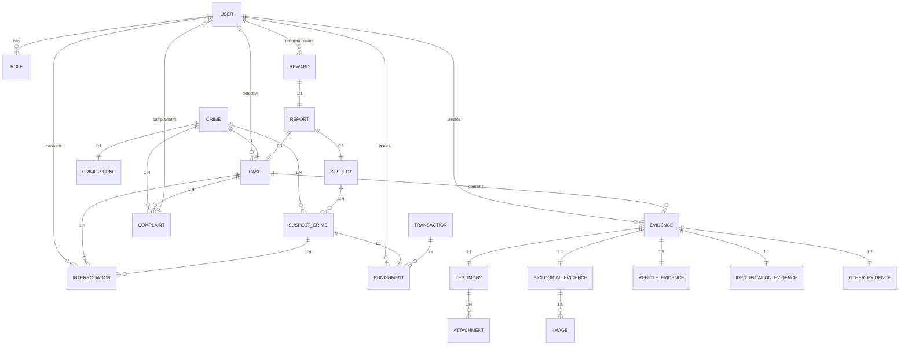

### Core Models Overview

```python
# User Management
User (extends AbstractUser)
  ├── username, email, phone, national_id
  ├── role (ForeignKey to Role)
  └── Permissions based on role

Role
  ├── title (unique)
  └── Permissions (M2M)

# Crime Management
Crime
  ├── level (1-4 severity)
  ├── created_at (timestamp)
  └── Relationships: Case, CrimeScene, SuspectCrime

Case
  ├── crime (OneToOne)
  ├── detective (ForeignKey)
  ├── is_from_crime_scene (boolean)
  ├── is_closed (boolean)
  └── Relations: Evidence, Complaint, Interrogation

Complaint
  ├── complainants (M2M User)
  ├── description (text)
  ├── cadet, police_officer (ForeignKey)
  ├── status (workflow state)
  └── case (ForeignKey)

CrimeScene
  ├── crime (OneToOne)
  ├── examiner (ForeignKey User)
  ├── witness (ForeignKey User)
  ├── seen_at, location
  └── is_confirmed (boolean)

# Suspect Management
Suspect
  ├── name, nickname, description
  ├── gender, national_id
  ├── picture (ImageField)
  ├── status (suspected/wanted/most_wanted/arrested/convicted)
  ├── wanted_since (DateTime)
  ├── priority_score (auto-calculated)
  ├── reward_amount (auto-calculated)
  └── Dynamic status transitions

SuspectCrime (M2M Suspect & Crime)
  ├── suspect (ForeignKey)
  ├── crime (ForeignKey)
  ├── added_by (User)
  └── Triggers priority score updates

Interrogation
  ├── suspect_crime (ForeignKey)
  ├── case (ForeignKey)
  ├── interrogators (M2M User - Detective/Sergeant)
  ├── detective_score, sergeant_score (0-10)
  ├── final_score (calculated)
  └── location, notes, date

Punishment
  ├── suspect_crime (OneToOne)
  ├── punishment_type (fine/bail/imprisonment/death)
  ├── title, description
  ├── amount, duration_months
  ├── issued_by (Judge)
  ├── is_paid, paid_at
  └── payment_reference

# Evidence Management
Evidence (Base class - abstract)
  ├── case (ForeignKey)
  ├── title, description
  ├── seen_at, created_at
  ├── created_by (User)
  └── location

Testimony (extends Evidence)
  ├── transcription (text)
  ├── attachments (M2M Attachment)
  └── is_confirmed (boolean)

BiologicalEvidence (extends Evidence)
  ├── images (M2M Image)
  ├── coronary (ForeignKey User)
  └── result (text)

VehicleEvidence (extends Evidence)
  ├── vehicle_model, color
  ├── registration_plate_number XOR serial_number
  └── Constraint: exactly one identifier

IdentificationEvidence (extends Evidence)
  ├── owner_first_name, owner_last_name
  └── information (JSONField - flexible key-value)

OtherEvidence (extends Evidence)
  └── Generic evidence type

Image
  ├── image (ImageField)
  └── uploaded_by (User)

Attachment
  ├── file (FileField)
  └── provided_by (User)

# Reward System
Reward
  ├── unique_code (UUID)
  ├── recipient (ForeignKey User)
  ├── amount (BigIntegerField)
  ├── created_by (User)
  ├── is_claimed, claimed_at
  └── created_at

Report (Tip)
  ├── reporter (User)
  ├── case (ForeignKey) OR suspect (ForeignKey)
  ├── description (text)
  ├── status (workflow state)
  ├── officer, detective (ForeignKey)
  └── created_at

# Payment
Transaction
  ├── factor_id (unique, auto-generated)
  ├── trans_id, id_get (gateway IDs)
  ├── amount (BigIntegerField)
  ├── mobile_num, description
  ├── card_number
  ├── is_success, is_used
  └── created_at, updated_at
```

### Relationships Diagram

```
User ──┐
       ├──→ Role (N:1)
       ├──→ Case (detective: 1:N)
       ├──→ Interrogation (interrogators: N:M)
       ├──→ Evidence (created_by: 1:N)
       └──→ Reward (recipient/created_by: 1:N)

Crime ──┐
        ├──→ Case (1:1)
        ├──→ CrimeScene (1:1)
        ├──→ Complaint (1:N)
        └──→ SuspectCrime (1:N)

Suspect ──┐
          ├──→ SuspectCrime (1:N)
          └──→ Interrogation (via SuspectCrime)

Evidence ──┐
           ├──→ Case (1:N)
           ├──→ Testimony, BiologicalEvidence, etc.
           └──→ Image/Attachment (M2M)
```

---

## 🔄 Key Workflows

### API Authentication & Authorization Flow

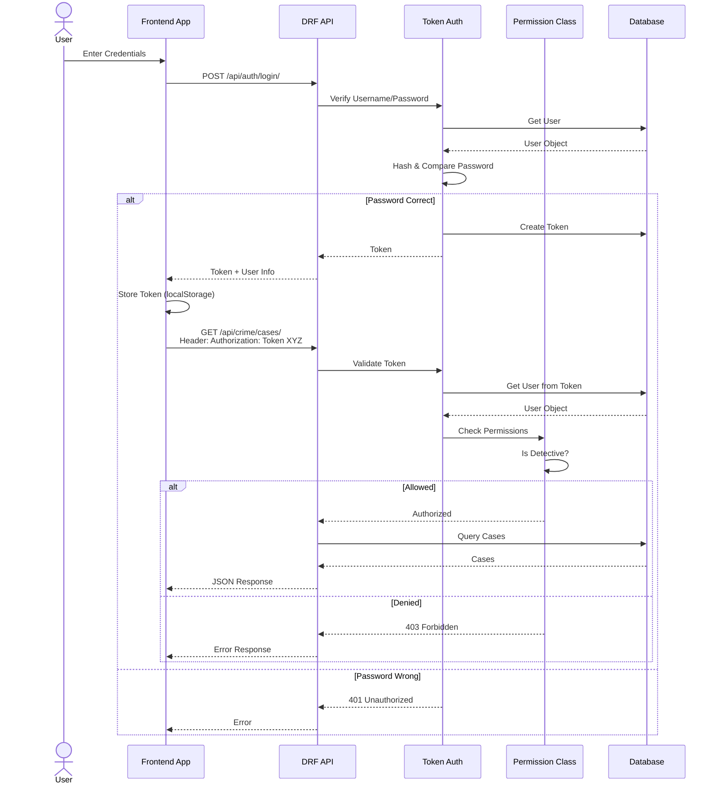

### Case Investigation Flow

```
1. Crime Reported/Observed
   ↓
2. Complaint Filed or Crime Scene Documented
   ↓
3. Cadet Validates Initial Information
   ↓
4. Officer Reviews and Approves
   ↓
5. Case Created & Detective Assigned
   ↓
6. Detective Collects Evidence
   ↓
7. Detective Analyzes on Board & Identifies Suspects
   ↓
8. Sergeant Interrogates Suspects
   ↓
9. Sergeant Determines Guilt Probability
   ↓
10. Captain Reviews & Approves Case
    ↓
11. Judge Reviews & Issues Verdict
    ↓
12. Punishment Recorded & Enforced
    ↓
13. Case Closed
```

### Evidence Lifecycle

```
Physical Evidence Found
    ↓
Documented by Officer/Detective
    ↓
Categorized (Biological/Vehicle/Identification/Other)
    ↓
For Biological: Sent to Coroner
    ↓
Analysis/Verification Complete
    ↓
Linked to Suspect via Detective Board
    ↓
Used in Trial
    ↓
Archived
```

### Suspect Status Progression

```
discovered
    ↓
suspected (initial status)
    ↓
wanted (if involved in significant crime)
    ↓
most_wanted (if >30 days wanted + serious crime)
    ↓
arrested (captured)
    ↓
convicted (found guilty)
```

---

## ⚡ Performance & Scalability Architecture

### Deployment Architecture

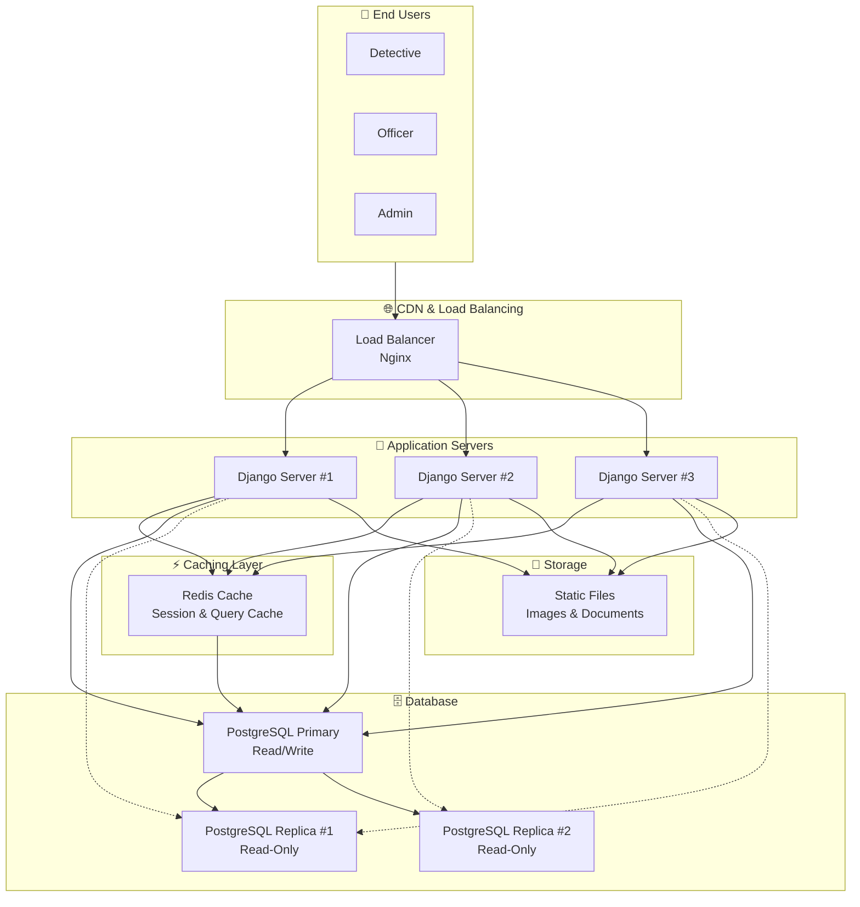

### Query Optimization Strategy

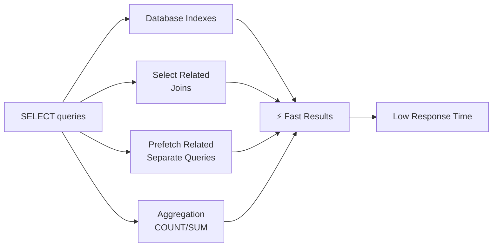

### Caching Strategy

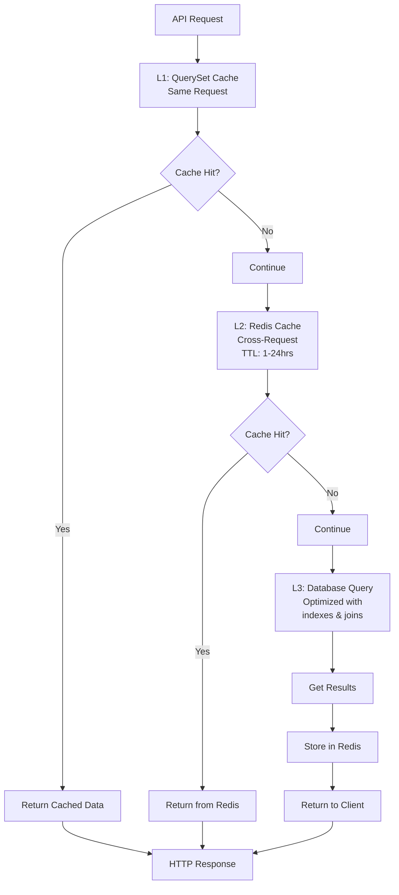

---

## 🧪 Testing

### Run Tests

```bash
# All tests
python manage.py test

# Specific app tests
python manage.py test crime
python manage.py test suspect
python manage.py test witness

# With coverage
pip install coverage
coverage run --source='.' manage.py test
coverage report
coverage html  # Generate HTML report
```

### Create Test Data

```bash
# Generate 100 records of each type
python manage.py seed_complete_data --count 100

# Clear and regenerate
python manage.py seed_complete_data --count 15 --clear
```

---

⭐ If you find this project helpful, please star it on GitHub!
